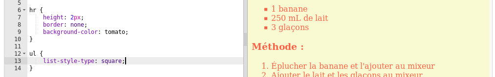

## Touches finales

Ajoutons un peu plus de HTML et de CSS pour améliorer votre page Web.

+ Vous pouvez ajouter une ligne horizontale à la fin de votre recette en utilisant le tag `
`.

Notez que cette balise n'a pas de balise de fin, tout comme la balise ``.

+ La ligne que vous venez d'ajouter ne correspond pas au style du reste de votre page Web. Corrigeons cela en ajoutant du code CSS:

    heure {
        hauteur: 2px;
        bordure: aucune;
        couleur de fond: tomate;
    }
    

+ Vous pouvez même changer l'apparence de vos puces avec ce code CSS:

    ul {
        list-style-type: square;
    }
    

