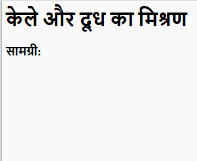
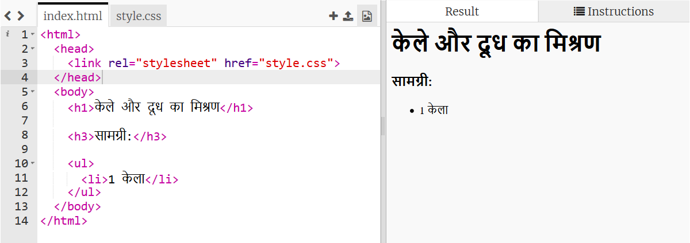

## सामग्री

चलिए आपकी रेसिपी के लिए आवश्यक सामग्री की सूची बनाते हैं।

+ इस टैंपलेट ट्रिंकेट को खोलें: [jumpto.cc/html-template](http://jumpto.cc/html-template){:target="_blank"}.
    
    आपकी परियोजना इस तरह दिखनी चाहिए:
    
    

+ आपकी सामग्री की सूची के लिए, आप `<ul>` टैग से **अव्यवस्थित सूची ** का उपयोग करेंगे। टैंपलेट की पंक्ति 8 पर जाएँ और यह HTML जोड़ें, `<h1>` शीर्षक को अपनी खुद की रेपिसी के नाम के साथ बदलें:

    <h1>केले और दूध का मिश्रण</h1>
    
    <h3>सामग्री:</h3>
    
    <ul>
    
    </ul>
    

+ अपना वेबपेज देखें, और आपको अपने दो शीर्षक दिखाई देने चाहिए।

आपको अभी भी अपनी सूची दिखाई नहीं देगी, क्योंकि आपने अभी तक कोई भी चीज़े इस सूचि में शामिल नहीं किया हैं!

+ अगला चरण है, `<li>` टैग इस्तेमाल करके अपनी सूची में चीज़े भरिये। अपने `<ul>` टैग में निम्नलिखित कोड जोड़ें:

    <li>1 banana</li>
    

क्योंकि आपकी सूची अव्यवस्थित है, आपके सूची में कोई भी संख्या दिख नहीं रही है, सिर्फ बुलेट पॉइंट्स हैं।