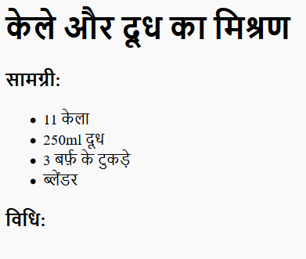
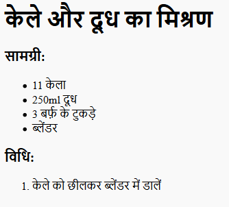

## विधि

इसके बाद, चलिए आपको रेसिपी तैयार करने के बारे में बताएँ।


+ आप अपनी विधि लिखने के लिए अन्य सूची का उपयोग करेंगे, परन्तु इस बार आप `<ol>` टैग का इस्तेमाल करके __क्रमबद्ध सूची__का उपयोग करेंगे।

क्रमबद्ध सूची क्रमांकित सूची होती है, जिसका उपयोग आपको तब करना चाहिए जब चरणों का क्रम महत्वपूर्ण हो।

इस कोड को अपनी सामग्री की सूची के नीचे जोड़ें, और यह सुनिश्चित करें कि यह अभी भी आपके `<body>` टैग के भीतर है:

```
<h3>Method:</h3>

<ol>

</ol>
```



+ अब आपको बस सूची के आइटम्स को अपनी क्रमबद्ध सूची में जोड़ना है:

```
<li>Peel the banana and add to a blender</li>
```



ध्यान दें कि सूची के आइटम्स स्वयं क्रमांकित हो गए हैं!

