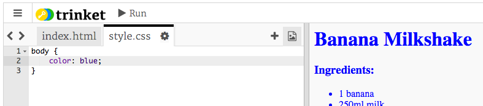
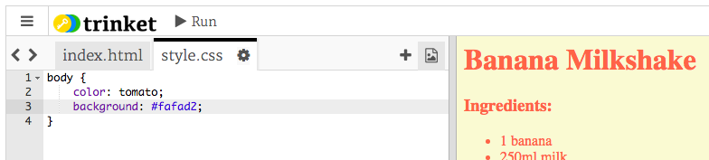

## रंग!

चलिए आपकी रेसिपी के वेबपेज में कुछ रंग जोड़ें।


+ आपने वेबपेज पर रंगीन टेक्स्ट जोड़ना पहले ही सीख लिया है। वेबसाइट बॉडी में पूरे टेक्स्ट को नीला करने के लिए, इस कोड को अपनी `style.css` फाइल में जोड़ें:

```
body {
    color: blue;
}
```



+ आपका ब्राउज़र `blue`, `yellow` और यहाँ तक कि `lightgreen` जैसे रंगों के बारे में जानता है, परन्तु क्या आप जानते हैं कि आपका ब्राउज़र वास्तव में 140 से ज़्यादा रंगों के__नाम__ जानता है?

आपके लिए उपयोग करने के लिए, सभी रंगों की सूची है: [jumpto.cc/colours](http://jumpto.cc/colours), जिसमें `tomato`, `firebrick` और `peachpuff` जैसे रंगों के नाम शामिल हैं।

टेक्स्ट के रंग को `blue` से `tomato` में बदलें।


+ आपका ब्राउज़र 140 रंगों के नाम जानता है, परन्तु वास्तव में यह 16 मिलियन से ज़्यादा रंगों __रंगों के मान__ जानता है!


अपने ब्राउज़र को यह बताने के लिए कि कौन सा रंग प्रदर्शित करना है, आपको केवल इसे यह बताना होता है कि लाल, हरे और नीले रंग की कितनी मात्रा का उपयोग करना है।

लाल, हरे और नीले रंग की मात्रा को `0` और `255` के बीच संख्या के रूप में लिखा जाता है।


वेबपेज की बॉडी के लिए, हल्का पीला पृष्ठभूमि प्रदर्शित करने के लिए, CSS में यह कोड जोड़ें:

```
background: rgb(250,250,210);
```


+ यदि आप चाहें, तो आप हेक्साडेसिमल कोड (या __हेक्स कोड__) का इस्तेमाल करके ब्राउज़र को बता सकते हैं कि कौन सा रंग प्रदर्शित करना है। यह उपर्युक्त `rgb()` कोड की तरह काम करता है, सिवाय इसके कि हेक्स कोड हमेशा `#` से शुरू होता है, और लाल, हरे और नीले के लिए `00` और `ff` के बीच हेक्साडेसिमल ‘संख्याओं’ का उपयोग करता है।


अपने CSS में `rgb()` कोड को हेक्स कोड से बदलें:

```
background: #fafad2;
```



आपको पहले की तरह समान हल्का पीला रंग दिखाई देना चाहिए!


