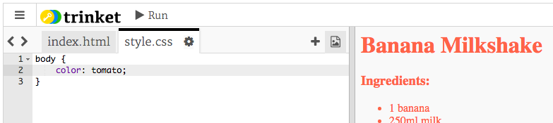
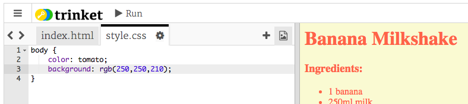

## रंग!

चलिए आपकी रेसिपी के वेबपेज को रंगीन बनाते हैं।

+ आपने पहले से सिख रखा हैं कैसे अपने वेबपेज में रंगीन शब्द जोड़ा जाता हैं। आपकी वेबपेज कि शब्दों को नीला करने के लिए, अपने `style.css` फाइल में यह कोड जोड़ दीजिये:

    body {
        color: blue;
    }
    

+ Your browser knows colours like `blue`, `yellow` and even `lightgreen`, but did you know that your browser actually knows the **names** of over 140 different colours?

There’s a list of all the colour names you can use: [jumpto.cc/colours](http://jumpto.cc/colours), which includes colour names like `tomato`, `firebrick` and `peachpuff`.

Change the text colour from `blue` to `tomato`.

+ Your browser knows the names of 140 colours, but actually knows the **colour values** of more than 16 million colours!

To tell the browser which colour to display, you just need to let it know how much red, green and blue to use.

The amounts of red, green and blue are written as a number between `0` and `255`.

Add this code to the CSS for the body of the webpage, to display a light yellow background:

    background: rgb(250,250,210);
    

+ If you prefer, you can tell the browser which colour to display by using a hexadecimal code (or **hex code**). This works in a similar way to the `rgb()` code above, except that hex codes always start with a `#`, and use hexadecimal ‘numbers’ between `00` and `ff` for the amount of red, green and blue.

Replace the `rgb()` code in your CSS with this hex code:

    background: #fafad2;
    

You should see the same light yellow as before!