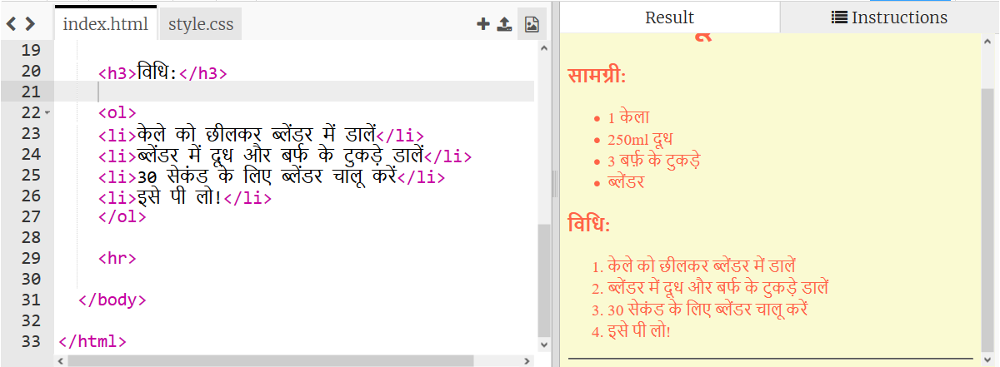
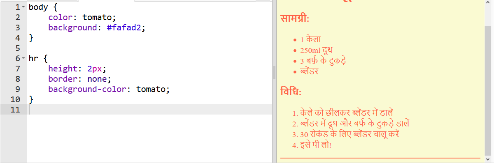
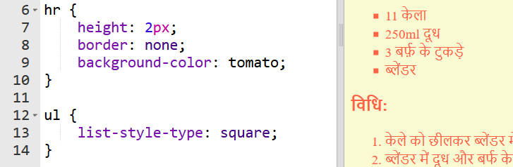

## अंतिम समापन कार्य

आइए आपके वेब पृष्ठ को बेहतर बनाने के लिए थोड़ा और HTML और CSS जोड़ें।

+ आप `
` टैग का उपयोग करके अपनी रेसिपी के अंत में एक क्षैतिज रेखा जोड़ सकते हैं।

ध्यान दें कि `` टैग की तरह, इस टैग का कोई अंतिम टैग नहीं है।

+ आपके द्वारा अभी जोड़ी गई रेखा आपके शेष वेब पृष्ठ की स्टाइल से मेल नहीं खाती है। चलिए कुछ CSS कोड जोड़कर इसे ठीक करें:

    hr {
        height: 2px;
        border: none;
        background-color: tomato;
    }
    

+ आप CSS कोड द्वारा अपने बुलेट पॉइंट्स का स्वरूप भी बदल सकते हैं:

    ul {
        list-style-type: square;
    }
    

