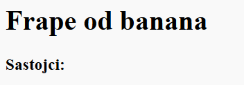

## Sastojci

Navedimo na listi sastojke koji su potrebni za vaš recept.

+ Otvorite predložak na trinket: [jumpto.cc/html-template](http://jumpto.cc/html-template){:target="_blank"}.
    
    Projekt bi trebao izgledati ovako:
    
    

+ Za vašu listu sastojaka, koristiti ćete **neuređenu listu**, koristeći `<ul>` tag. Idite na liniju 8 predloška i dodajte HTML kod, umjesto teksta u `<h1>` naslovu sa naslovom svog recepta:

    <h1>Frape od banana</h1>
    
    <h3>Sastpjci:</h3>
    
    <ul>
    
    </ul>
    

+ Pogedajte vašu interentsku stranicu, trebali bi vidjeti vaša dva naslova.

Nećete još uvijek vidjeti vašu listu, jer niste dodali niti jedan sastojak na listu!

+ Sljedeći korak je dodavanje sastojaka na vašu listu, koristeći `<li>` tag. Dodajte sljedeći kod unutar vašeg `<ul>` taga:

    <li>1 banana</li>
    

Pošto je vaša lista neuređena, ne postoje brojevi pored pojedinog sastojka, već smo buleti.