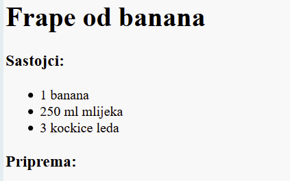
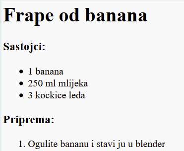

## Priprema

Sljedeće, objasnimo kako ćete izraditi vaš recept.

+ Korisiti ćete drugu listu za pisanje svoje metode, ali sada ćete koristiti **uređenu listu**, koristeći `<ol>` tag.

Uređena lista je numerirana lista, koja se koristi kada je redosljed koraka bitan.

Dodajte sljedeći kod ispod vaše liste sastojaka, budite sigurni da je unutar vašeg `<body>` taga:

    <h3>Priprema:</h3>
    
    <ol>
    
    </ol>
    

+ Sada morate samo dodati na listu sastojke vaše nove uređene liste:

    <li>Ogulite bananu i stavite ju u blender</li>
    

Uočite da su sastojci na listi automataski numerirani!