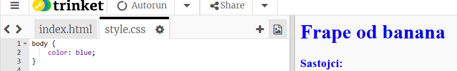
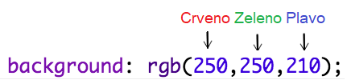
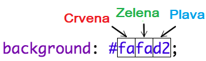
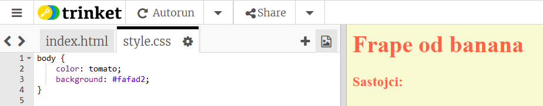

## Boje!

Let’s add some colour to your recipe webpage.

+ Već ste naučili kako dodati tekst druge boje na vašu internetsku stranicu. Dodajte sljedeći kod unutar vaše `style.css` datoteke, kako bi sav tekst u tijelu stranice bio plav:

    body {
        color: blue;
    }
    

+ Vaš preglednik zna za boje kao što su `plava`, `žuta` čak i `svijetlo zelena`, ali jeste li znali da vaš preglednik zapravo zna **imena** preko 140 različitih boja?

There’s a list of all the colour names you can use: [jumpto.cc/colours](http://jumpto.cc/colours), which includes colour names like `tomato`, `firebrick` and `peachpuff`.

Promijenite boju teksta iz `plavo` u `rajčica`.

+ Vaš preglednik zna imena 140 boja, ali zapravo zna **vrijednosti boja** za preko 16 milijuna boja!

Kako bi vaš preglednik znao koju boju prikazati, trebate mu samo dati do znanja koliko crvene, zelene i plave treba koristiti.

Količina crvene, zelene i plave je pisana brojevima između `0` i `255`.

Dodajte ovaj kod u CSS za tijelo vaše stranice, za prikaz svijetlo žute pozadine:

    background: rgb(250,250,210);
    

+ Ako preferirate, možete vašem pregledniku reći koju boju će prikazati koristeći hexadecimalni kod (ili **hex kod**). Radi na sličan način kao i `rgb()` kod iznad, osim što hex kod uvijek starta sa `#`, i koristi hexadecimalne 'brojeve' između `00` i `ff` za količinu crvene, zelene i plave.

Zamijenite `rgb()` kod u vašem CSS-u sa sledećim hex kodom:

    background: #fafad2;
    

Trebali bi vidjeti istu svijetlo žutu kao i prije!