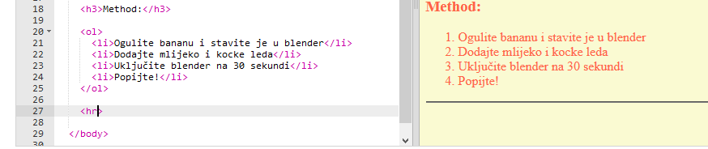
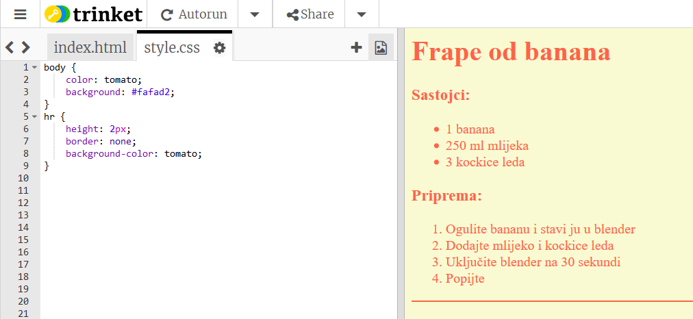

## Završne finese

Dodajmo još malo HTML i CSS koda kako bi poboljšali stranicu.

+ Dodajte horizontalnu liniju na kraj vašeg recepta, koristeći `
` tag.

Uočite da ovaj tag nema završni tag, kao i `` tag.

+ Linija koju ste dodali ne podudara se sa stilom ostatka vaše stranice. Ispravimo to dodajući malo CSS koda:

    hr {
        height: 2px;
        border: none;
        background-color: tomato;
    }
    

+ You can even change how your bullet points look with this CSS code:

    ul {
        list-style-type: square;
    }
    

