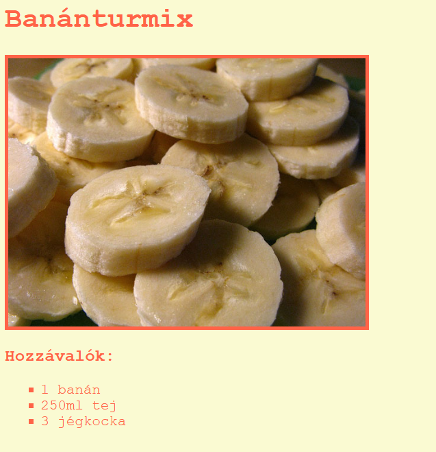

## Bevezetés

Ebben a projektben megtanulhatod, hogyan hozhatsz létre weboldalt a kedvenc receptednek.

### További információk klubvezetőknek

Ha ki szeretnéd nyomtatni ezt a projektet, kérjük, használd a [nyomtatóbarát verziót](https://projects.raspberrypi.org/en/projects/recipe/print).

## \--- collapse \---

## title: Klubvezetői jegyzetek

## Bevezetés:

A projekt során a gyerekek megismerkednek a HTML listákkal és a CSS színekkel. Elkészítik saját receptjüket hozzávalókkal és az elkészítés módjával.

## Online segédanyagok

Javasoljuk a [trinket](https://trinket.io/) használatát, hogy HTML-t és CSS-t szerkesszünk online.

A gyerekek ezt az üres trinketet [(jumpto.cc/html-blank)](http://jumpto.cc/html-blank) is használhatják, hogy saját HTML és CSS kódot írjanak, vagy alternatívaként használhatják ezt a sablon trinketet[(jumpto.cc/html-template)](http://jumpto.cc/html-template) is.

Rendelkezésre áll egy trinket egy mintamegoldással a kihívásokra:

+ ['Recept' kész változata - trinket.io/html/c0fd9b40cd](https://trinket.io/html/c0fd9b40cd)

## Offline segédanyagok

Ez a projekt [offline is teljesíthető](https://www.codeclubprojects.org/en-GB/resources/webdev-working-offline/). A projekt segédanyagaihoz a 'Projektanyagok' linkre kattintva férhetsz hozzá. Ezen a linken található a 'Projekt segédanyagai' rész, amely tartalmazza a segédanyagokat, amelyek a projekt offline teljesítéséhez szükségesek. Győződj meg arról, hogy minden gyermek rendelkezik ezekkel a segédanyagokkal. Ez a szakasz a következő fájlokat tartalmazza:

+ template/index.html
+ template/style.css

A projekt kihívásainak teljesített változatát az „Önkéntes erőforrások” szakaszban is megtalálod, amely a következőket tartalmazza:

+ recipe-finished/index.html
+ recipe-finished/style.css
+ recipe-finished/banana.jpg

(Az összes fenti segédanyag letölthető projekt és önkéntes `.zip` fájlként.)

## Tanulási célok

+ HTML írása:
    
    + `<ul>`, `<ol>` és `<li>` listaelemek;
    + `
` ele,;
    + Az egymásba ágyazott elemek használatának megerősítése.

+ CSS írása:
    
    + Színek (nevek és hexadecimális kódok).

Ez a projekt a [Raspberry Pi Digitális Alkotás Tanterv](http://rpf.io/curriculum) következő részéből fed le elemeket:

+ [Alapvető 2D és 3D elemek tervezése](https://www.raspberrypi.org/curriculum/design/creator).

## Kihívások

"Több hozzávaló" - további elemek hozzáadása rendezetlen listához; "Több lépés" - további elemek hozzáadása rendezett listához; "Több szín" - színnevek, rgb és hexadecimális kódok hozzáadása; "Vélemények" - újabb rendezetlen lista hozzáadása; "Több stílus" - képek és betűstílus hozzáadása.

## Projekt elvégzése offline

Ha a gyermekek offline módon fejezik be a projektet, akkor a használni kívánt képeket ugyanabba a mappába kell menteniük, mint a Template.html fájlt.

Ezután hozzáadhatják a fájl nevét az `` elemekhez:

    
    

\--- /collapse \---

## \--- collapse \---

## title: Projekt anyagok

## Segédanyagok a projekthez

+ [.zip fájl, amely tartalmazza a projekt összes segédanyagát](https://rpf.io/p/en/recipe-go)
+ [Online Trinket sablon](http://jumpto.cc/trinket-template)
+ [Üres online Trinket](http://jumpto.cc/trinket-blank)
+ [template/index.html](resources/template-index.html)
+ [template/style.css](resources/template-style.css)

## Segédanyagok klubvezetőknek

+ [.zip fájl, amely tartalmazza az elkészült projekt összes erőforrását](https://rpf.io/p/en/recipe-go)
+ [Online befejezett Trinket projekt](https://trinket.io/html/c0fd9b40cd)
+ [recipe-finished/index.html](resources/recipe-finished-index.html)
+ [recipe-finished/style.css](resources/recipe-finished-style.css)
+ [recipe-finished/banana.png](resources/recipe-finished-banana.png)

\--- /collapse \---