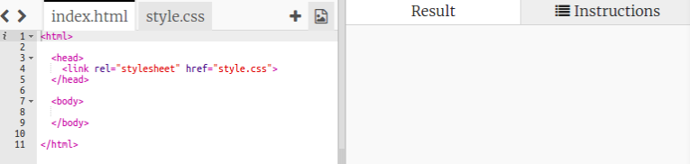
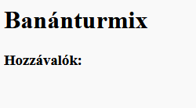
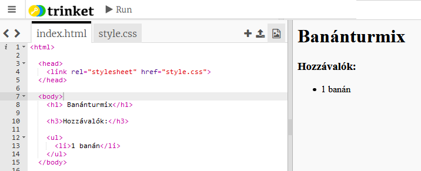

## Hozzávalók

Sorold fel a recepthez szükséges összetevőket.

+ Nyissa meg ezt a sablon trinket: [jumpto.cc/html-template](http://jumpto.cc/html-template) {: target = "_ blank"}.
    
    A projektnek így kéne kinéznie:
    
    

+ Az összetevők listájához **rendezetlen listát** kell használni, a `<ul>` címkével. Ugorj a sablon 8. sorára, és add hozzá ezt a HTML-t, helyettesítve a `<h1>` cím szövegét a saját recepted szövegével:

    <h1>Banánturmix</h1>
    
    <h3>Hozzávalók:</h3>
    
    <ul>
    
    </ul>
    

+ Nézd meg weboldalad, és látnod kellene a két címsort.

Még nem fogod látni a listádat, mert még nem adtál hozzá semmilyen listaelemet!

+ A következő lépés, a `<li>` címkével felvenni a lista elemeit a listába. Adja hozzá a következő kódot a `<ul>` címkén belül:

    <li>1 banán</li>
    

Mivel a listája nincs rendezve, a listaelemek mellett nincsenek számok, csak pontok.