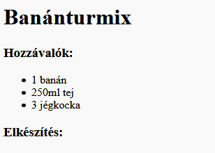
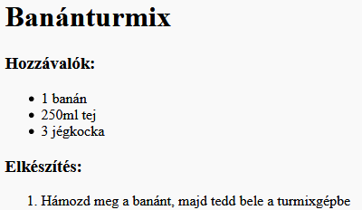

## Elkészítés

Most magyarázzuk el, hogyan kell elkészíteni a receptedet.

+ Egy újabb listát fogsz használni, hogy leírd az elkészítés lépéseit, de most **rendezett listát** fogsz használni, az `<ol>` elemmel.

A rendezett lista számozott lista, amelyet akkor kell használni, ha a lépések sorrendje fontos.

Add hozzá ezt a kódot a hozzávalók listája alá, ügyelve arra, hogy még mindig a `<body>` elemen belül legyen:

    <h3>Elkészítés:</h3>
    
    <ol>
    
    </ol>
    

+ Most már csak hozzá kell adniod az elemeket az új rendezett listához:

    <li>Hámozd meg a banánt, majd tedd bele a turmixgépbe</li>
    

Figyeld meg, hogy a listaelemek automatikusan számozódnak!