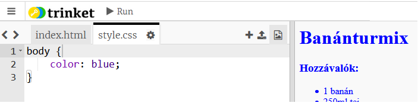
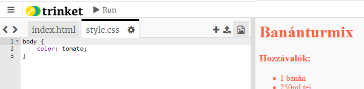
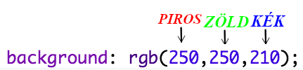
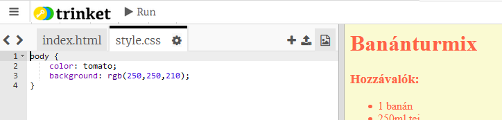
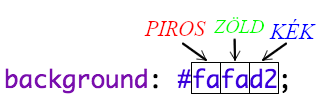
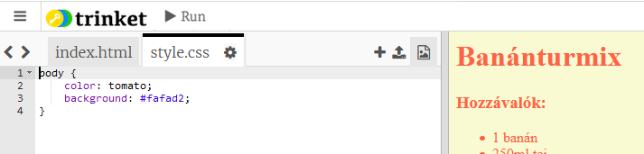

## Színek!

Adjunk hozzá néhány színt a weboldalhoz.

+ Már megtanulta, hogyan kell színes szöveget hozzáadni egy weboldalhoz. Adja hozzá ezt a kódot a `style.css` fájl belsejébe, hogy a webhely teljes szövege kékké váljon:

    body {
        color: blue;
    }
    

+ Böngészője ismeri a `blue`, a `yellow` még a `loghtgreen`színt is, de tudta, hogy a böngésző valójában több mint 140 különböző szín **neveit** ismeri?

Itt található az összes használható színnév: [jumpto.cc/colours](http://jumpto.cc/colours), amely olyan színneveket tartalmaz, mint `tomato`, `firebrick` és `peachpuff`.

Változtassa meg a szöveg színét `blueról tomatora.`.

+ A böngésző 140 szín nevét ismeri, de valójában több mint 16 millió szín **színértékét** fel tudja ismerni!

Ahhoz, hogy megmondja a böngészőnek melyik színt kell megjeleníteni, csak tudatnia kell vele, hogy mennyi vörös, zöld és kék színt kell használni.

A vörös, zöld és kék mennyiség `0` és `255`közötti számként van írva.

Add hozzá ezt a kódot a CSS törzséhez, hogy világossárga háttér legyen:

    background: rgb(250,250,210);
    

+ Ha úgy tetszik hexadecimális kódot is lehet használni. Ez hasonlóan működik, a fenti `rgb ()` kódhoz, azzal a különbséggel, hogy a hexadecimális kódok mindig `#`el kezdődnek, és hexadecimális „számot” használnak `00` és `ff` között a vörös, zöld és kék szín mennyiségét megadva.

Cserélje ki a CSS-ben található `rgb ()` kódot erre a hexadecimális kódra:

    background: #fafad2;
    

Ugyanazt a sárgát kell látnia, mint korábban!