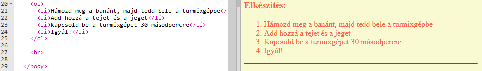
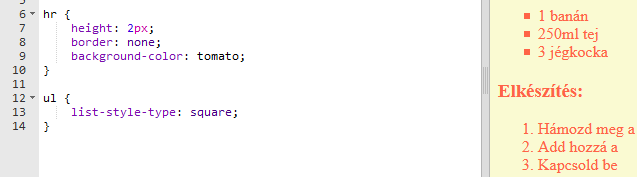

## Utolsó simítások

Adjunk hozzá még egy kicsi HTML-t és CSS-t a weboldal tökéletesítéséhez.

+ A recept végéhez vízszintes sort adhatsz a `
` elem használatával.

Vedd figyelembe, hogy ennek az elemnek nincs záró eleme, csakúgy, mint az `` elemnek.

+ A hozzáadott sor illik bele a weboldal stílusába. Javítsuk ki ezt egy kis CSS-kód hozzáadásával:

    hr {
        height: 2px;
        border: none;
        background-color: tomato;
    }
    

+ CSS kóddal a felsorolásjel kinézetét is meg lehet változtatni:

    ul {
        list-style-type: square;
    }
    

