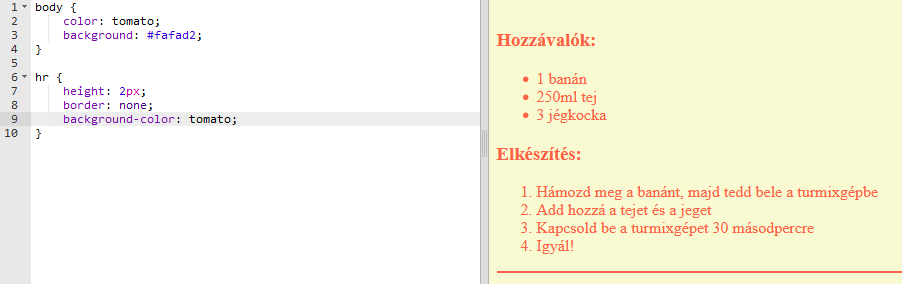

## Utolsó simítások

Adjunk hozzá még egy kicsit HTML-t és CSS-t webhelyének javításához.

+ A recept végéhez vízszintes sort adhat a `
` címke használatával.

Vegye figyelembe, hogy ennek a címkének nincs végcímkéje, csakúgy, mint a `` címke.

+ Az Ön által hozzáadott sor nem egyezik meg a többi weboldal stílusával. Javítsuk ki ezt néhány CSS-kód hozzáadásával:

    óra {
        magasság: 2 képpont;
        határ: nincs;
        háttér szín: paradicsom;
    }
    

+ A CSS-kóddal megváltoztathatja még a golyópontok megjelenését is:

    ul {
        list-style-type: square;
    }
    

