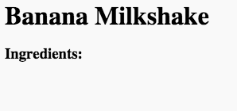

## Bahan

Mari daftar bahan-bahan yang dibutuhkan untuk resep Anda.

+ Buka trinket template ini: [jumpto.cc/html-template](http://jumpto.cc/html-template){: target = "_ blank"}.
    
    Proyek akan terlihat seperti ini:
    
    

+ Untuk daftar bahan-bahan Anda, Anda akan menggunakan **daftar tanpa urutan**, menggunakan tag `<ul>`. Pergi ke baris 8 dari template dan tambahkan HTML ini, mengganti teks dalam judul `<h1>` dengan nama resep Anda sendiri:

    <h1>Banana Milkshake</h1>
    
    <h3>Bahan:</h3>
    
    <ul>
    
    </ul>
    

+ Lihat halaman web Anda, dan Anda akan melihat dua judul Anda.

Anda belum akan melihat daftar Anda, karena Anda belum menambahkan item daftar apa pun ke dalamnya!

+ Langkah selanjutnya adalah menambahkan item daftar ke daftar Anda, dengan menggunakan tag `<li>`. Tambahkan kode berikut di dalam tag `<ul>`:

    <li>1 pisang</li>
    

Karena daftar Anda tidak disusun, tidak ada angka di samping daftar item, hanya poin-poin.