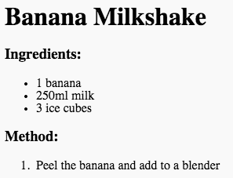

## metode

Selanjutnya, mari jelaskan cara membuat resep Anda.

+ Anda akan menggunakan daftar lain untuk menulis metode Anda, tetapi kali ini Anda akan menggunakan **daftar urutan**, dengan menggunakan tag `<ol>`.

Daftar yang dipesan adalah daftar bernomor, yang harus Anda gunakan ketika urutan langkah-langkah itu penting.

Tambahkan kode ini di bawah daftar bahan Anda, pastikan bahwa itu masih di dalam tag `<body>`:

    <h3>Metode:</h3>
    
    <ol>
    
    </ol>
    

+ Sekarang Anda hanya perlu menambahkan item daftar ke dalam daftar pesanan baru Anda:

    <li>Kupas pisang dan tambahkan ke blender</li>
    

Perhatikan bahwa daftar item secara otomatis diberi nomor!