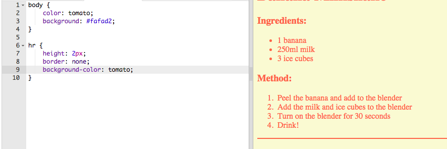

## Sentuhan akhir

Mari tambahkan sedikit lebih banyak HTML dan CSS untuk meningkatkan halaman web Anda.

+ Anda dapat menambahkan garis horizontal di akhir resep Anda, dengan menggunakan tag `
`.

Perhatikan bahwa tag ini tidak memiliki tag akhir, seperti tag ``.

+ Baris yang baru saja Anda tambahkan tidak cocok dengan gaya dari sisa halaman web Anda. Mari perbaiki itu dengan menambahkan beberapa kode CSS:

    hr {
        height: 2px;
        batas: tidak ada;
        warna latar belakang: tomat;
    }
    

+ Anda bahkan dapat mengubah bagaimana poin-poin bullet Anda terlihat dengan kode CSS ini:

    ul {
        list-style-type: persegi;
    }
    

