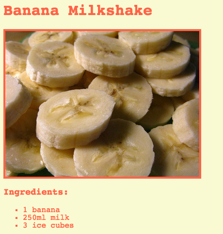

## Introduzione

In this project, you’ll learn how to create a webpage for your favourite recipe.

### Ulteriori informazioni per gli organizzatori dei club

Se intendete stampare questo progetto, cliccate su [Versione stampabile](https://projects.raspberrypi.org/en/projects/recipe/print).

## \--- collapse \---

## title: Note per i volontari

## Introduzione:

In this project, children will learn about HTML lists and CSS colours. They will create their own recipe, adding ingredient and method lists.

## Risorse online

We recommend using [trinket](https://trinket.io/) to write HTML & CSS online.

I ragazzi possono anche usare questo trinket vuoto [(jumpto.cc/html-blank)](http://jumpto.cc/html-blank) per scrivere liberamente in HTML e CSS, oppure possono usare questo modello [(jumpto.cc/html-template)](http://jumpto.cc/html-template).

È disponibile anche un trinket con esempi di soluzioni alle sfide:

+ [‘Recipe’ Finished -- trinket.io/html/c0fd9b40cd](https://trinket.io/html/c0fd9b40cd)

## Risorse offline

Se preferite, questo progetto può anche essere [completato offline](https://www.codeclubprojects.org/en-GB/resources/webdev-working-offline/). È possibile accedere alle risorse del progetto facendo click sul link "Materiali del progetto" relativo a questo progetto. Questo link contiene una sezione "Risorse del progetto", con le risorse necessarie ai ragazzi per completare il progetto offline. Assicuratevi che ogni ragazzo abbia accesso a una copia di queste risorse. Questa sezione include i seguenti file:

+ template/index.html
+ template/style.css

Potete trovare una possibile soluzione delle sfide di questo progetto nella sezione 'Risorse per i volontari', che contiene:

+ recipe-finished/index.html
+ recipe-finished/style.css
+ recipe-finished/banana.jpg

(Tutte le risorse sopracitate sono anche scaricabili come file progetto e volontario `.zip `.)

## Obiettivi di apprendimento

+ Writing HTML:
    
    + `<ul>`, `<ol>` and `<li>` list tags;
    + `
` tag;
    + Consolidating the use of nested tags.

+ Writing CSS:
    
    + Colours (names & hexadecimal codes).

Questo progetto include elementi tratti dalle seguenti componenti del [Digital Making Curriculum di Raspberry Pi](http://rpf.io/curriculum):

+ [Risorse base di progettazione 2D e 3D](https://www.raspberrypi.org/curriculum/design/creator).

## Sfide

"More ingredients" - adding more items to an unordered list; "More steps" - adding more items to an ordered list; "More colours" - adding colour names, rgb values and hex codes; "Reviews" - adding another unordered list; "More styling" - adding images and fonts.

## Completing this project offline

If children are completing this project offline, they’ll need to save images they intend to use in the same folder as their Template.html file.

They can then just add the name of the file in their `` tags:

    
    

\--- /collapse \---

## \--- collapse \---

## title: Materiali del progetto

## Risorse del progetto

+ [File .zip con tutte le risorse del progetto](resources/recipe-project-resources.zip)
+ [Modello Trinket online](http://jumpto.cc/trinket-template)
+ [Trinket online vuoto](http://jumpto.cc/trinket-blank)
+ [template/index.html](resources/template-index.html)
+ [template/style.css](resources/template-style.css)

## Risorse per i volontari

+ [File .zip con tutte le risorse del progetto](resources/recipe-volunteer-resources.zip)
+ [Trinket online completato](https://trinket.io/html/c0fd9b40cd)
+ [recipe-finished/index.html](resources/recipe-finished-index.html)
+ [recipe-finished/style.css](resources/recipe-finished-style.css)
+ [recipe-finished/banana.png](resources/recipe-finished-banana.png)

\--- / chiudi \---