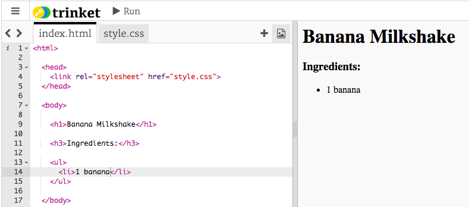

## Ingredienti

Ecco gli ingredienti necessari per la ricetta.

+ Apri questo modello trinket: [jumpto.cc/html-template](http://jumpto.cc/html-template).

	Il progetto dovrebbe avere questo aspetto:

	

+ Per l’elenco di ingredienti, userai un __elenco non ordinato__ con il tag `<ul>`. Vai alla linea 8 del modello e aggiungi questo HTML, sostituendo il testo nel titolo `<h1>` con il nome della tua ricetta.

```
<h1>Frappè di banana</h1>

<h3>Ingredienti:</h3>

<ul>

</ul>
```

+ Visualizza la pagina web e dovresti vedere due intestazioni.


Non vedrai ancora il tuo elenco poiché non hai ancora aggiunto nessun elemento!

+ Il prossimo passo è aggiungere elementi al tuo elenco utilizzando il tag `<li>`. Aggiungere il codice seguente nell’etichetta `<ul>`:

```
<li>1 banana</li>
```


Dato che l’elenco non è ordinato non ci sono numeri accanto agli elementi dell’elenco, solo punti.

