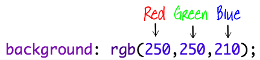

##  Colori!

Aggiungiamo un po’ di colore alla pagina web con la tua ricetta.

+ Hai già imparato come aggiungere testo colorato a una pagina web. Aggiungi questo codice all’interno del file `style.css`per rendere blu tutto il testo nel corpo del sito web:

```
body {
    color: blue;
}
```


+ Il browser conosce colori come `blue` (blu), `yellow` (giallo) e anche `lightgreen` (verde chiaro), ma lo sapevi che in realtà conosce i __nomi__ di oltre 140 colori?

Ecco un elenco di tutti i nomi di colori che puoi usare: [jumpto.cc/colours](http://jumpto.cc/colours), che include nomi di colori come `tomato`(pomodoro), `firebrick` (mattone) e `peachpuff`(pesca).

Cambia il colore del testo da `blue` (blu) a `tomato` (pomodoro).


+ Il tuo browser conosce i nomi di 140 colori, ma in realtà conosce i __valori__ di oltre 16 milioni di colori!


Per dire al browser quale colore visualizzare, basta sapere la quantità di rosso, verde e blu da usare.

Le quantità di rosso, verde e blu sono scritte come un numero compreso tra `0` e `255`.



Aggiungi questo codice al CSS per cambiare il colore del corpo della pagina web e visualizzare uno sfondo giallo:

```
background: rgb(250,250,210);
```


+ Se preferisci, puoi dire al browser quale colore mostrare utilizzando un codice esadecimale (o __hex code__). Funziona in modo simile al codice `rgb()` qui sopra, eccetto che i codici esadecimali iniziano sempre con una `#`, e utilizzano "numeri" esadecimali compresi tra `00` e `ff` per la quantità di rosso, verde e blu.


Sostituisci il codice `rgb()` nel CSS con questo codice esadecimale:

```
background: #fafad2;
```


Dovresti vedere la stessa tonalità giallo chiaro di prima!
