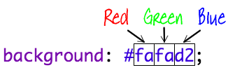

## 配色!

レシピのWebページに色を追加しましょう。

+ Webページに色付きのテキストを追加する方法は既に学習しました。 style.cssファイル内に次のコードを追加して、Webサイトの本文のすべてのテキストを青にします。

    body {
        color: blue;
    }
    

+ あなたのブラウザは青blue、黄yellow、さらには薄緑lightgreenのような色を知っていますが、あなたのブラウザが実際に140以上の異なる色の名前を知っていることを知っていましたか？

使用できるすべての色名のリストがあります。[jumpto.cc/colours](http://jumpto.cc/colours)には、トマト`tomato`、耐火レンガ`firebrick`、肌色`peachpuff`などの色名が含まれています。

テキストの色を青blueからトマトtomatoに変更します。

+ ブラウザは140色の名前を知っていますが、実際には1600万色以上の色の値を知っています！

表示する色をブラウザに指示するには、使用する赤、緑、青の量をブラウザ側に知らせる必要があります。

赤、緑、青の量は、0から255の間の数値として書き込まれます。

Webページの本文のCSSに次のコードを追加して、明るい黄色の背景を表示します。

    background: rgb(250,250,210);
    

+ 必要に応じて、16進コード（または16進コード）を使用して、表示する色をブラウザーに指示できます。 これは上記のrgb（）コードと同様に機能しますが、16進コードは常に＃で始まり、赤、緑、青の量に00からffまでの16進数の「数字」を使用する点が異なります。 

CSSのrgb（）コードを次の16進コードに置き換えます。 

    background: #fafad2;
    

以前と同じ明るい黄色が表示されるはずです！