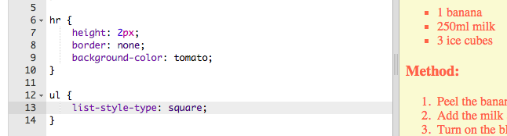

## 仕上げ

Webページを改善するために、もう少しHTMLとCSSを追加しましょう。 

+ `
`タグを使用して、レシピの最後に水平線を追加できます。

このタグには、``タグのように終了タグがないことに注意してください。

+ 追加した行は、ウェブページの他のスタイルとは不釣り合いです。 CSSコードを追加して修正しましょう。 

    hr {
        height: 2px;
        border: none;
        background-color: tomato;
    }
    

+ このCSSコードを使用して、箇条書きの外観を変更することもできます。 

    ul {
        list-style-type: square;
    }
    

