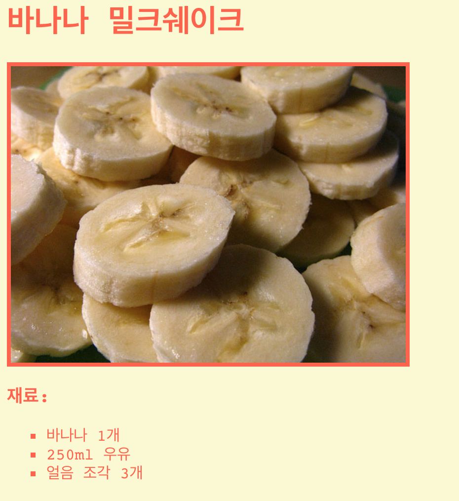

## 들어가며

이 프로젝트에서는 자신이 좋아하는 음식의 레시피를 설명하는 웹페이지를 만듭니다.

### 교육자들을 위한 추가 정보

이 프로젝트를 인쇄하려면 [프린트용 문서](https://projects.raspberrypi.org/en/projects/recipe/print)를 사용하십시오.

## \--- collapse \---

## 교육자들을 위한 메모

## 소개

이 프로젝트에서 학생들은 HTML List와 CSS Colours를 배웁니다. 음식의 재료와 만드는 방법을 추가하여 그들만의 레시피를 만들 것 입니다. 

## 온라인 자료들

이 자료에서는 [Trinket](https://trinket.io/)을 사용하여 HTML & CSS를 온라인으로 편집할 것을 권장합니다.

학생들은 새로운 Trinket[(jumpto.cc/html-black)](http://jumpto.cc/html-blank)을 사용할 수 있으며, 이를 통해 자신만의 HTML & CSS 코드를 작성하는 법을 배울 수 있습니다. 또한, 템플릿이 제공되어 있는 Trinket을 사용할 수 있습니다. [(jumpto.cc/html-template)](http://jumpto.cc/html-template).

프로젝트의 샘플 정답이 다음 Trinket에 있습니다.

+ ['레시피' 완료 버전 -- trinket.io/html/c0fd9b40cd](https://trinket.io/html/c0fd9b40cd)

## 오프라인 자료

여러분의 선호에 따라 프로젝트를 [오프라인에서 완성](https://www.codeclubprojects.org/en-GB/resources/webdev-working-offline/)할 수 있습니다. 'Project Materials' 라는 링크를 클릭하여 이 프로젝트의 자료를 확인해볼 수 있습니다. 이 링크에는 학생들이 프로젝트를 오프라인으로 완료하는 데 필요한 자료가 포함된 'Project Resource' 섹션이 있습니다. 학생들이 이러한 자료의 사본에 접근할 수 있는지 확인하십시오. 이 섹션에는 아래와 같은 파일들이 포함되어 있습니다.

+ template/index.html
+ template/style.css

이 프로젝트의 완성된 버전은 'Volunteer Resources' 섹션에서 찾을 수 있습니다. 다음 파일이 있습니다:

+ recipe-finished/index.html
+ recipe-finished/style.css
+ recipe-finished/banana.jpg

(또한 위의 모든 자료는 프로젝트 및 자원봉사자 `.zip` 파일로 다운로드 할 수 있습니다.)

## 학습 목표

+ HTML 사용:
    
    + `<ul>`, `<ol>` 및 `<li>` 목록 태그
    + `
` 태그
    + 중첩 태그 사용 통합

+ CSS 사용:
    
    + 색상(이름 & 16진법코드)

이 프로젝트는 [라즈베리파이 디지털 메이킹 커리큘럼](http://rpf.io/curriculum) 중 아래의 과정에 있는 요소들을 다룹니다.

+ [2D와 3D 디자인](https://www.raspberrypi.org/curriculum/design/creator)

## 도전과제

"더 많은 재료"- 순서 없는 리스트에 더 많은 항목을 추가합니다; "더 많은 단계"- 순서 있는 리스트에 항목을 더 추가합니다; "다른 색상"- 색상 이름, RGB 값 및 16 진수 코드 추가; "리뷰"- 정렬되지 않은 다른 목록 추가; "홈페이지 꾸미기"- 이미지 및 글꼴 추가.

## 오프라인으로 프로젝트 수행하기

만약 학생들이 이 프로젝트를 오프라인에서 수행할 경우, 그들은 사용하고자하는 이미지를 Template.html 파일과 같은 폴더에 저장해야 합니다.

그런 다음 ``태그에 파일이름을 추가할 수 있습니다. 

    
    

\--- /collapse \---

## \--- collapse \---

## title: 프로젝트 자료

## 프로젝트 리소스

+ [프로젝트의 모든 리소스가 들어있는 .zip 파일](https://rpf.io/p/en/recipe-go)
+ [온라인 Trinket 템플릿](http://jumpto.cc/trinket-template)
+ [빈 Trinket](http://jumpto.cc/trinket-blank)
+ [template/index.html](resources/template-index.html)
+ [template/style.css](resources/template-style.css)

## 교육자를 위한 자료

+ [완성된 모든 프로젝트 리소스가 들어있는 .zip 파일](https://rpf.io/p/en/recipe-go)
+ [완성된 온라인 Trinket 프로젝트](https://trinket.io/html/c0fd9b40cd)
+ [recipe-finished/index.html](resources/recipe-finished-index.html)
+ [recipe-finished/style.css](resources/recipe-finished-style.css)
+ [recipe-finished/banana.png](resources/recipe-finished-banana.png)

\--- /collapse \---