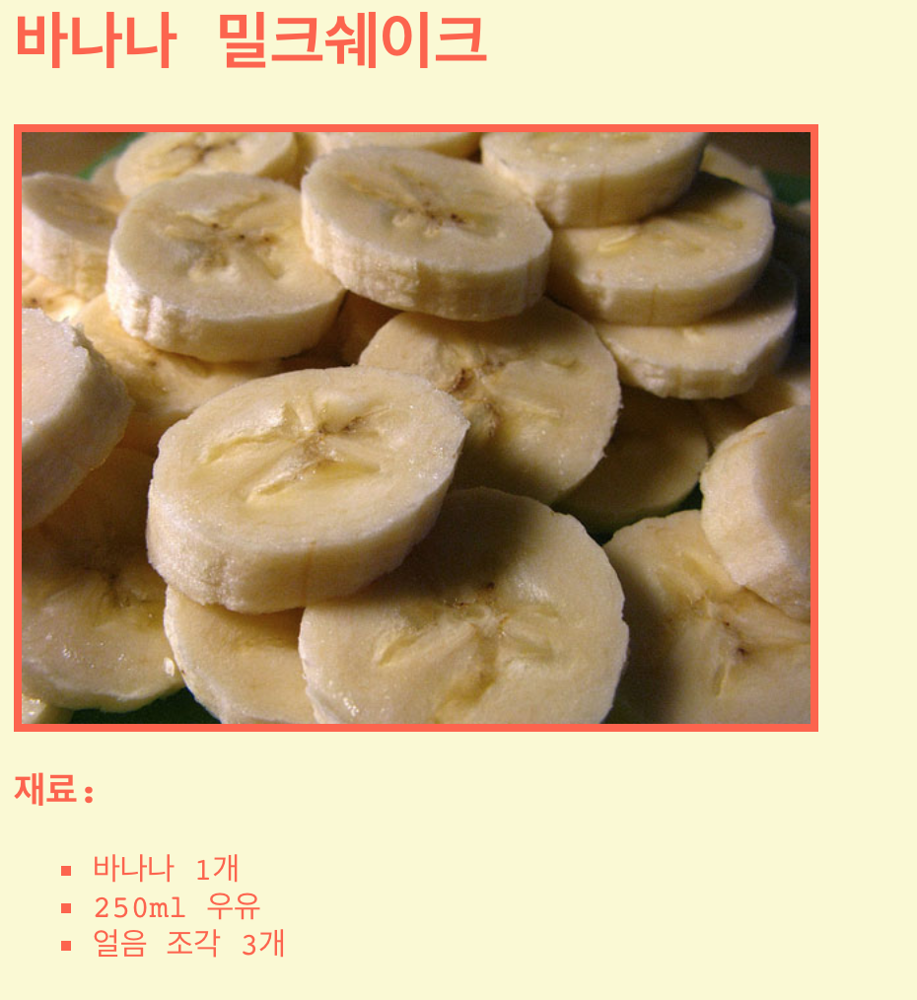

\--- challenge \---

## 과제: 스타일 꾸미기

이미지를 레시피 페이지에 추가할 수 있습니까? 아니면 폰트를 수정할 수 있나요? 아래와 같이 웹페이지가 보일 것입니다.

여러분에게 힌트 Code를 드리도록 하겠습니다:

    font-family: Arial / Comic Sans MS / Courier / Impact / Tahoma;
    font-size: 12pt;
    font-weight: bold;
    
    
    

\--- /challenge \---