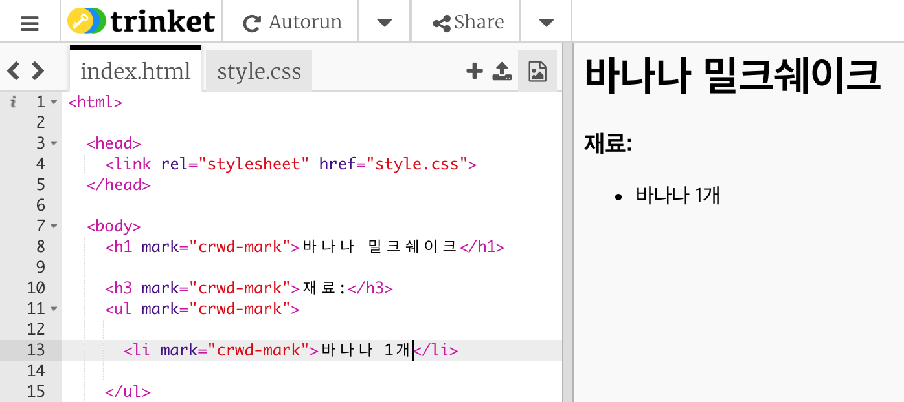

## 레시피 재료 추가하기

재료 목록을 레시피에 추가해 봅시다.

+ 템플릿 Trinket을 열어주세요: [jumpto.cc/html-template](http://jumpto.cc/html-template){:target="_blank"}.
    
    프로젝트는 아래와 같이 보일 것입니다:
    
    

+ 재료들을 리스트에 추가할 때, **순서 없는 리스트**(`<ul>` 태그 사용)를 삽입합니다. Trinket의 8번째 줄에 아래 Code를 삽입하세요, 그리고 `<h1>` 텍스트에 있는 이름을 자신이 레시피를 작성하고자 하는 음식으로 바꾸세요.

    <h1>바나나 밀크쉐이크</h1>
    
    <h3>재료:</h3>
    
    <ul>
    
    </ul>
    

+ 홈페이지를 열어 보시면 아래와 같이 두 헤딩을 볼 수 있습니다.

아직 리스트가 보이지 않을 것입니다! 아이템을 추가하지 않았기 때문입니다.

+ 다음 단계는 `<li>` 태그를 활용하여 리스트에 아이템을 추가하는 것입니다. 아래 Code를 `<ul>` 태그 안에 삽입하세요.

    <li>바나나 1개</li>
    

순서 없는 리스트에서는 숫자 없이 그냥 동그란 원 하나만 보일 것입니다.