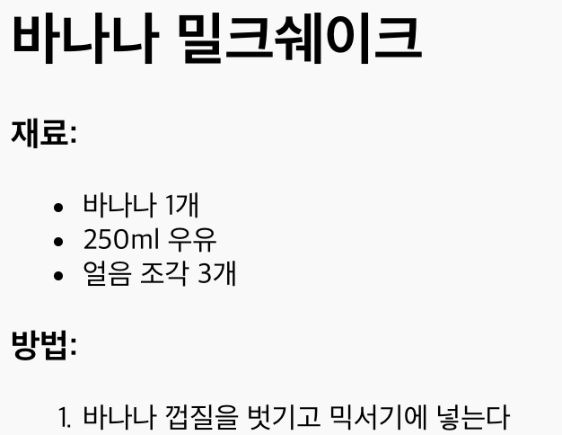

## 레시피 방법 추가하기

요리 방법을 적기 위해서는 기존 리스트가 아닌 새로운 리스트를 작성해야 합니다. 이번에는 <0>정렬된 리스트</0>(<1> 태그 사용)를 활용하여 요리의 방법을 적어 봅시다.

+ 요리의 방법을 적기 위해서는 기존 리스트가 아닌 새로운 리스트를 작성해야 합니다. 이번에는 **정렬된 리스트**(`<ol>` 태그 사용)를 활용하여 요리의 방법을 적어 봅시다.

정렬된 리스트는 번호가 매겨진 리스트로, 리스트의 단계 순서가 중요한 경우 사용합니다.

재료 리스트 아래 이 코드를 추가하여, `<body>`태그 안에 있는지 확인하세요.

    <h3>방법:</h3>
    
    <ol>
    
    </ol>
    

+ 아래 항목을 새로운 정렬된 리스트에 삽입합니다.

    <li>바나나 껍질을 벗기고 믹서기에 넣는다</li>
    

이 리스트에 있는 항목들은 자동으로 숫자가 매겨집니다!