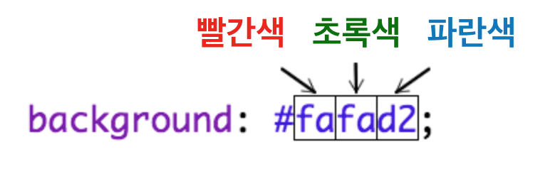

## 색상 추가하기

레시피 웹페이지에 색상을 추가해 봅시다.

+ 우리는 이미 웹페이지에 컬러 텍스트를 추가하는 방법을 알고 있습니다. 아래 Code를 `style.css` 파일에 추가하면, 웹페이지의 모든 텍스트가 파란색으로 바뀝니다.

    body {
        color: blue;
    }
    

+ 브라우저는 `blue`, `yellow`, 심지어 `lightgreen` 등의 색상도 인지 하지만, 브라우저가 140가지 이상의 다른 색깔들의 **이름 **을 실제로 알고 있다는 것을 알고 있나요?

[jumpto.cc/colours](http://jumpto.cc/colours) 페이지에서 색상명을 알 수 있습니다. 여기서는 `tomato`, `firebrick`, `peachpuff` 등의 색상명도 찾을 수 있습니다.

텍스트 색상을 `blue`에서 `tomato`으로 바꾸어 봅시다.

+ 당신의 브라우저는 140가지 색상의 이름을 알고 있지만 실제로 1,600만 개 이상의 색상의 ** 색상 값 **을 알고 있습니다.

쓰고 싶은 색상이 있는경우 해당 색상의 빨간색, 초록색, 파란색의 값을 브라우저에 알려 주면 됩니다.

빨간색, 초록색, 파란색의 값은 `0`부터 `255`사이의 숫자로 표현됩니다.

웹페이지 본문의 CSS에 이 Code 추가하여, 배경을 밝은 노란색으로 바꾸어 봅시다:

    background: rgb(250,250,210);
    

+ 원한다면 RGB 색상 값을 **16진수 코드** 색상값으로 나타낼 수 있습니다. 16진수 코드가 항상 `#`으로 시작한다는 점과 빨간색, 초록색, 파란색의 값을 `00`부터 `ff`까지 16진수 숫자를 사용한다는 점을 제외하고는 위의 `rgb()` 코드와 유사합니다.

CSS의 `rgb()` 코드를 다음 16진수 코드로 대체하십시오.

    background: #fafad2;
    

아까와 같은 밝은 노란색을 볼 수 있습니다!