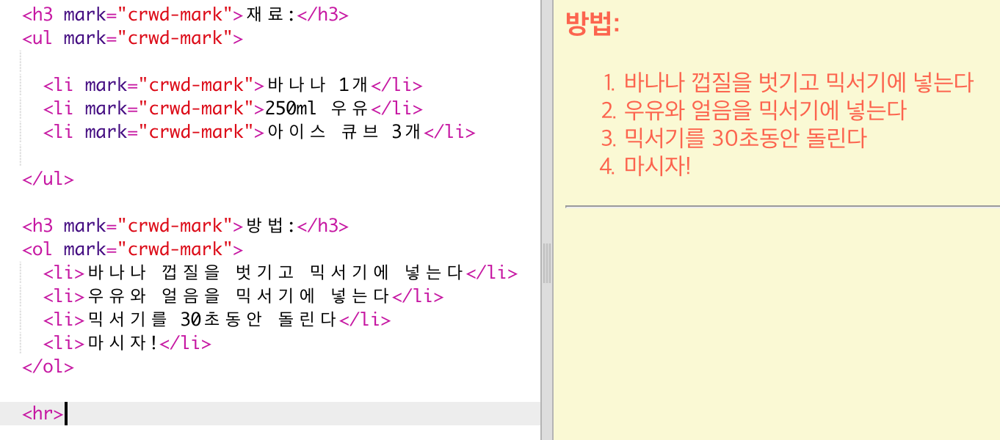
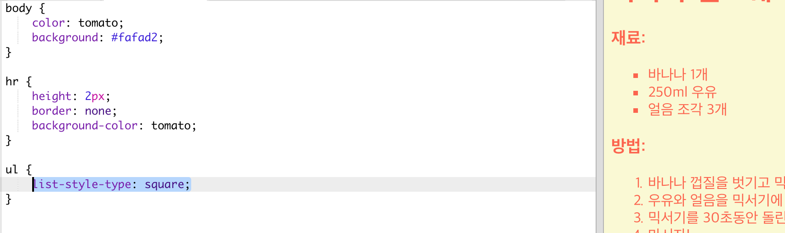

## 레시피 제작 마무리

HTML과 CSS 코드를 조금 더 추가하여 웹페이지를 개선시켜 봅시다.

+ 레시피 끝에 `
`태그를 사용하여 가로줄을 추가할 수 있다.

이 태그는 끝을 의미하는 태그가 존재하지 않으며, 단순한 `` 같은 태그입니다.

+ 방금 추가한 줄이 웹페이지의 스타일과 일치하지 않습니다. 아래와 같이 CSS Code를 수정하여 해결할 수 있습니다:

    hr {
        height: 2px;
        border: none;
        background-color: tomato;
    }
    

+ CSS코드로 기호를 변경할 수 있습니다.

    ul {
        list-style-type: square;
    }
    

