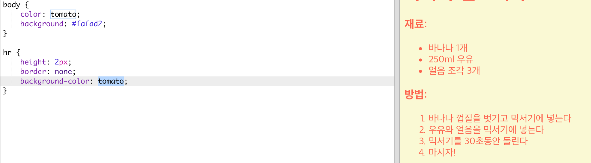

## 레시피 제작 마무리

HTML과 CSS 코드를 조금만 더 추가해서 홈페이지를 완성시켜 봅시다.

+ 아래와 같이 내용 끝에 줄을 추가하고 싶은 경우 `
` 태그를 사용합니다.

이 태그는 끝을 의미하는 태그가 존재하지 않으며, 단순한 `` 같은 태그입니다.

+ 근데 줄과 홈페이지의 색깔하고 뭔가 어울리지 않습니다. 아래와 같이 CSS Code를 수정하여 해결할 수 있습니다:

    hr {
        height: 2px;
        border: none;
        background-color: tomato;
    }
    

+ 아래와 같이 둥근 포인트를 사각형으로 바꿀 수 있습니다.

    ul {
        list-style-type: square;
    }
    

