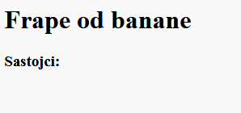
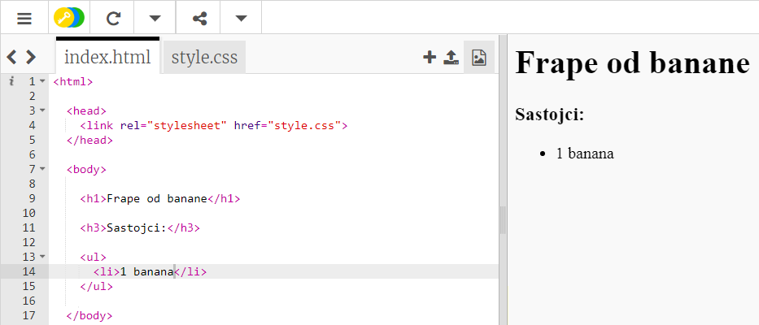

## Sastojci

Napravimo listu sastojaka potrebnih za tvoj recept.

+ Otvori ovaj trinket šablon: [jumpto.cc/html-template](http://jumpto.cc/html-template){:target="_blank"}.
    
    Projekat treba da izgleda ovako:
    
    

+ Za tvoju listu sastojaka upotrijebićemo **neuređenu listu**, koristeći oznaku `<ul>`. Idi u 8. red šablona i dodaj sljedeći HTML, a tekst koji se nalazi unutar oznake `<h1>` zamijeni nazivom svog recepta:

    <h1>Frape od banana</h1>
    
    <h3>Sastojci:</h3>
    
    <ul>
    
    </ul>
    

+ Pogledaj svoju veb-stranicu. Trebalo bi da vidiš svoja dva naslova.

Svoju listu još uvijek nećeš vidjeti, zato što u nju nije dodat nijedan elemenat!

+ Sljedeći korak je dodavanje elemenata liste u listu, koristeći oznaku `<li>`. Unutar oznake `<ul>` dodaj sljedeći kôd:

    <li>1 banana</li>
    

Pošto je tvoja lista neuređena, pored elemenata liste ne stoje brojevi, već samo tačke.