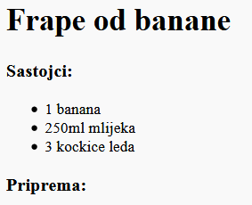

## Priprema

Objasnimo sada način pripreme tvog recepta.

+ Za opis načina pripreme koristićeš novu listu, ali ovog puta to će biti **uređena lista** za koju se koristi oznaka `<ol>`.

Uređena lista je lista sa rednim brojevima koju treba da koristiš kada je redosled koraka važan.

Dodaj ovaj kôd ispod svoje liste sastojaka, vodeći računa da bude unutar oznake `<body>`:

    <h3>Priprema:</h3>
    
    <ol>
    
    </ol>
    

+ Sada samo treba da dodaš elemente liste u svoju novu uređenu listu:

    <li>Oguli bananu i stavi je u blender</li>
    

Primijeti da su elementi liste automatski numerisani!