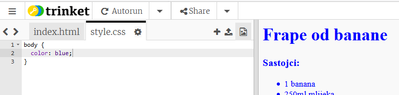
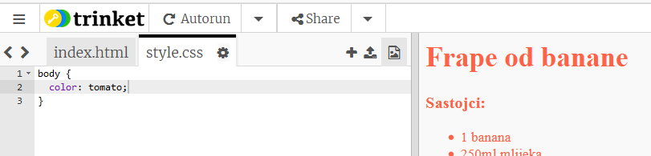
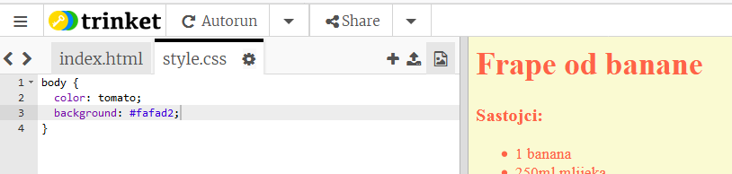

## Boje!

Dodajmo veb-stranici tvog recepta malo boja.

+ Već smo naučili kako da na veb-stranicu dodamo tekst u različitim bojama. U `style.css` datoteku dodaj sljedeći kôd, tako da sav tekst na veb-stranici bude plave boje:

    body {
        color: blue;
    }
    

+ Tvoj pregledač prepoznaje boje kao što su `blue` (plava), `yelow` (žuta), pa čak i `lightgreen` (svijetlozelena). Ali, da li ti je poznato da pregledač, u stvari, prepoznaje **nazive** za više od 140 različitih boja?

Ovdje se nalazi spisak svih naziva boja koje možeš koristiti: [jumpto.cc/colours](http://jumpto.cc/colours). Ovaj spisak sadrži nazive boja kao što su `tomato` (paradajz), `firebrick` (cigla) ili `peachpuff` (breskva).

Promijeni boju teksta iz `blue` u `tomato`.

+ Tvoj pregledač prepoznaje nazive 140 boja, ali zapravo zna **vrijednosti ** za više od 16 miliona boja!

Da bismo kazali pregledaču koju boju da prikaže, potrebno je da samo da odredimo koliko crvene, zelene i plave boje će koristiti.

Količine crvene (red), zelene (green) i plave (blue) boje određuju se brojem između `0` i `255`.

Dodaj CSS-u sljedeći kôd za tijelo (body) veb-stranice, kako bi se prikazala svijetložuta pozadina:

    background: rgb(250,250,210);
    

+ Ako želiš, možeš da kažeš pregledaču koju boju da prikaže koristeći heksadecimalni kôd ( ili **hex code**). Ovo funkcioniše na sličan način kao `rgb()` kôd iznad, osim što heksadecimalni kôd uvijek počinje znakom `#`, a za određivanje količine crvene, zelene i plave boje koristi heksadecimalne 'brojeve' između `00` i `ff`.

Zamijeni `rgb()` kôd u svom CSS-u sljedećim heksadecimalnim kôdom:

    background: #fafad2;
    

Trebalo bi da vidiš istu svijetložutu boju kao i ranije!