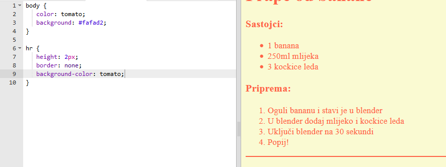
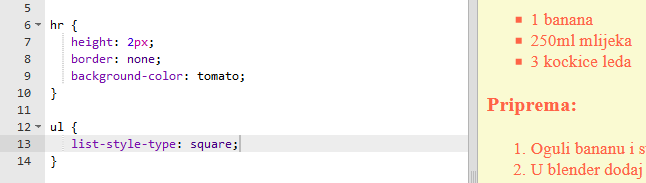

## Završni detalji

Dodajmo još malo HTML-a i CSS-a kako bismo poboljšali tvoju veb-stranicu.

+ Možeš da dodaš horizontalnu liniju na kraj svog recepta, koristeći oznaku `
`.

Imaj u vidu da ova oznaka nema završnu oznaku, isto kao oznaka ``.

+ Dodata linija ne slaže se sa stilom ostatka tvoje veb-stranice. Popravimo to dodajući CSS kôd:

    hr {
        height: 2px;
        border: none;
        background-color: tomato;
    }
    

+ Sljedećim CSS kôdom možeš čak promijeniti izgled znakova za nabrajanje:

    ul {
        list-style-type: square;
    }
    

