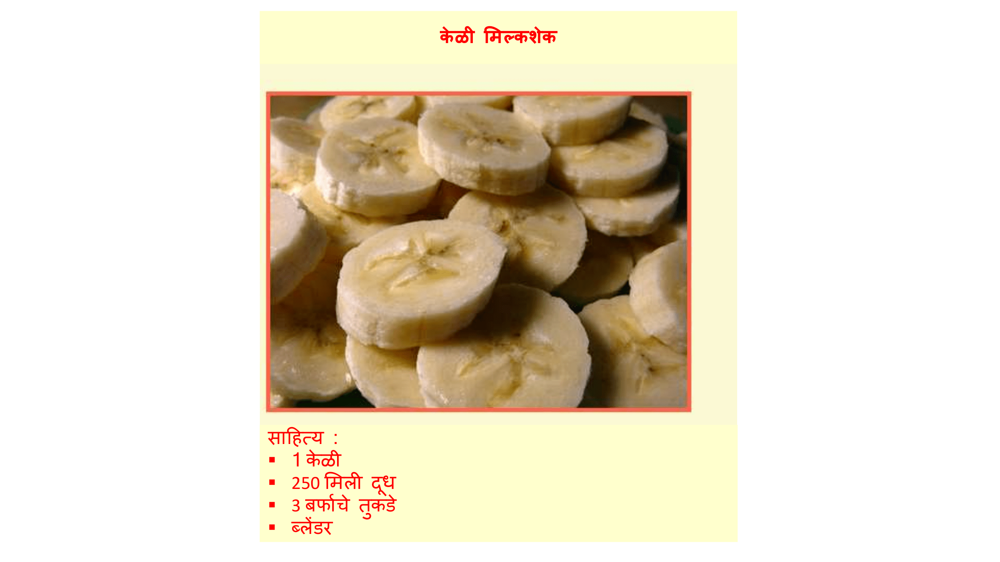

## परिचय

या प्रकल्पात आपण आपल्या पसंतीच्या पाककृतीसाठी वेबपेज कसे तयार करावे ते शिकाल.

### क्लब प्रमुखांसाठी अधिक माहिती

आपल्याला हा प्रकल्प प्रिंट करण्याची आवश्यकता असल्यास, [प्रिंट अनुकूल आवृत्ती](https://projects.raspberrypi.org/mr-IN/projects/recipe/print) वापरा.

--- collapse ---
---
title: क्लब प्रमुखांसाठी काही टिपा
---

## परिचय:

या प्रकल्पात मुले HTML lists आणि CSS मधील रंग यांविषयी शिकतील. साहित्य आणि पद्धती यांच्या याद्या जोडून ते स्वतःच्या पाककृती बनवतील.

## ऑनलाईन संसाधने

HTML & CSS ऑनलाइन लिहिण्यासाठीआम्ही [trinket](https://trinket.io/) वापरण्याची शिफारस करतो.

HTML & CSS लिहीण्यासाठी मुले blank trinket [(jumpto.cc/html-blank)](http://jumpto.cc/html-blank) चाही उपयोग करू शकतात अथवा वैकल्पिकरित्या ते template trinket [(jumpto.cc/html-template)](http://jumpto.cc/html-template)याचा उपयोग करू शकतात.

आव्हानांवर नमुना उपाय असणारा एक trinket देखील आहे:

+ [संपूर्ण ‘पाककृती ’ -- trinket.io/html/c0fd9b40cd](https://trinket.io/html/c0fd9b40cd)

## ऑफलाइन संसाधने

प्राधान्य असल्यास हा प्रकल्प [ऑफलाइन पूर्ण केला जाऊ शकतो](https://www.codeclubprojects.org/en-GB/resources/webdev-working-offline/). आपण या प्रकल्पाची संसाधने Project Material link वर​ क्लिक करून मिळवू शकता. या link मध्ये 'Project Resourses' विभाग आहे, ज्यामध्ये मुलांना हा प्रकल्प ऑफलाइन पूर्ण करण्यासाठी आवश्यक असणारी संसाधने आहेत. प्रत्येक मुलास या स्त्रोतांच्या प्रतीवर प्रवेश असल्याचे सुनिश्चित करा. या विभागात खालील फायली समाविष्ट आहेत:

+ template/index.html
+ template/style.css

आपल्याला या प्रकल्पातील आव्हानांची पूर्ण आवृत्ती 'Volunteer Resources' विभागात सापडेल, ज्यात हे आहे:

+ recipe-finished/index.html
+ recipe-finished/style.css
+ recipe-finished/banana.jpg

(वरील सर्व संसाधने प्रकल्प आणि स्वयंसेवक `.zip` फायली म्हणून डाउनलोड करण्यायोग्य देखील आहेत.)

## शिकण्याचे उद्दिष्टे

+ HTML लेखन:
    
    + `<ul>`, `<ol>` आणि `<li>` lists टॅग;
    + `
` टॅग;
    + नेस्टेड टॅगचा वापर एकत्रित करणे.

+ CSS लिहिणे:
    
    + रंग (नावे & हेक्झाडेसीमल कोड).

या प्रकल्पात [ ​​Raspberry Pi Digital Making Curriculum](http://rpf.io/curriculum) च्या खालील घटक समाविष्ट आहेत:

+ [मूलभूत 2D आणि 3D ऍसेटस्](https://www.raspberrypi.org/curriculum/design/creator){:target="_blank.

## आव्हाने

"अधिक साहित्य " - अक्रमांकित यादीमध्ये अधिक पदार्थ जोडणे; "अधिक पायऱ्या " - ऑर्डर यादीमध्ये अधिक पदार्थ जोडणे; "अधिक रंग" - रंगाची नावे, आरजीबी(rgb) मूल्ये आणि हेक्स कोड जोडणे; "पुनरावलोकने" - आणखी एक अक्रमांकित केलेली यादी जोडणे; "अधिक शैली" - प्रतिमा आणि फॉन्ट जोडणे.

## हा प्रकल्प ऑफलाइन पूर्ण करणे

मुले हा प्रकल्प ऑफलाइन पूर्ण करीत असल्यास, प्रतिमा जतन करत असताना त्यांना त्याच फोल्डरमध्ये Template.html मध्ये करणे आवश्यक आहे.

त्यानंतर ते त्यांच्या `` टॅगमध्ये फाईलचे नाव जोडू शकतात:

    
    

--- /collapse ---

--- collapse ---
---
title: प्रकल्प साहित्य
---

## प्रकल्प संसाधने

+ [सर्व प्रकल्प संसाधने असलेली.zip फाइल](https://rpf.io/p/mr-IN/recipe-go)
+ [ऑनलाइन ट्रिंकेट टेम्पलेट](http://jumpto.cc/trinket-template)
+ [ऑनलाइन रिक्त ट्रिंकेट](http://jumpto.cc/trinket-blank)
+ [template/index.html](resources/template-index.html)
+ [template/style.css](resources/template-style.css)

## क्लब प्रमुख संसाधने

+ [सर्व पूर्ण प्रकल्पाची संसाधने असलेली.zip फाइल](https://rpf.io/p/mr-IN/recipe-go)
+ [ऑनलाईन संपूर्ण Trinket प्रकल्प](https://trinket.io/html/c0fd9b40cd)
+ [recipe-finished/index.html](resources/recipe-finished-index.html)
+ [recipe-finished/style.css](resources/recipe-finished-style.css)
+ [recipe-finished/banana.png](resources/recipe-finished-banana.png)

--- /collapse ---