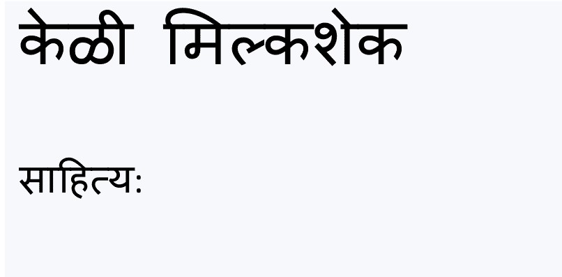

## साहित्य

आपल्या कृतीसाठी आवश्यक असलेल्या साहित्याची यादी करूया.

+ हा टेम्पलेट ट्रिंकेट उघडा:[jumpto.cc/html-template](http://jumpto.cc/html-template){:target="_blank"}.
    
    प्रकल्प असा दिसायला हवा:
    
    

+ आपल्या साहित्याच्या सूचीसाठी आपण **अक्रमांकित यादी** (unordered list) वापरणार आहोत, `<ul>` टॅग वापरुन. टेम्प्लेटच्या 8 व्या ओळीवर जा आणि `<h1>` शीर्षकातील मजकूरास आपल्या स्वत: च्या पाककृतीच्या नावाने बदलून हे HTML जोडा:

    <h1>Banana Milkshake</h1>
    
    <h3>Ingredients:</h3>
    
    <ul>
    
    </ul>
    

+ आपले वेबपृष्ठ पहा आणि आपल्याला आपली दोन शीर्षके दिसली पाहिजेत.

आपण अद्याप आपली सूची पाहू शकणार नाही, कारण आपण त्यात कोणतीही सूची पदार्थ जोडलेली नाहीत!

+ पुढील पायरी म्हणजे `<li>` टॅग वापरुन आपल्या यादीमध्ये सूची पदार्थ जोडणे. आपल्या `<ul>` टॅगमध्ये खालील कोड जोडा:

    <li>1 banana</li>
    

आपली यादी अक्रमांकीत असल्यामुळे, यादीतील पदार्थांच्या पुढे क्रमांक नाहीत, फक्त बुलेट पॉइंट्स आहेत.