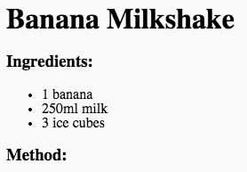

## कृती

पुढे, आपली कृती कशी बनवायची ते समजावून घेऊया.

+ आपली कृती लिहिण्यासाठी आपण आणखी एक सूची वापरणार आहात, परंतु यावेळी आपण **क्रमांकित यादी** चा वापर करणार आहोत `<ol>` टॅग वापरुन.

ऑर्डर केलेली यादी ही एक क्रमांकित यादी आहे, जी आपण पायऱ्यांची क्रमवारी महत्त्वाची असते तेव्हा वापरली पाहिजे.

हा कोड आपल्या साहित्य सूचीच्या खाली जोडा, तो अद्याप आपल्या `<body>` टॅगमध्ये आहे याची खात्री करुन:

    <h3>Method:</h3>
    
    <ol>
    
    </ol>
    

+ आता आपल्याला आपल्या नवीन ऑर्डर केलेल्या यादीमध्ये सूची पदार्थ जोडण्याची आवश्यकता आहे:

    <li>Peel the banana and add to a blender</li>
    

लक्षात घ्या की यादीतील पदार्थ आपोआप क्रमांकित झाले आहेत!