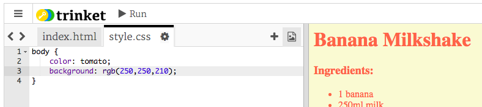

## रंग!

चला आपल्या पाककृती वेबपृष्ठावर थोडा रंग जोडूया.

+ वेबपृष्ठावर रंगीत मजकूर कसा जोडायचा हे आपण आधीच शिकलेले आहात. वेबसाइटमधील मुख्य मजकूर निळा करण्यासाठी आपल्या `style.css` फाईलमध्ये हा कोड जोडा:

    body {
        color: blue;
    }
    

+ आपल्या ब्राउझरला `blue`, `yellow` आणि अगदी `lightgreen` सारखे रंग माहित आहेत परंतु आपणास हे माहित आहे काय की आपल्या ब्राउझरला 140 पेक्षा जास्त वेगवेगळ्या ** रंगाची नावे** माहित आहेत?

आपण वापरू शकता अशा सर्व रंगांच्या नावांची एक सूची आहे: [jumpto.cc/colours ](http://jumpto.cc/colours), ज्यामध्ये `tomato`, `firebrick` आणि `peachpuff` सारख्या रंगांची नावे आहेत.

रंगाला `blue` बदलून त्याला `tomato` असा करा.

+ आपल्या ब्राउझरला 140 रंगांची नावे माहित आहेत परंतु प्रत्यक्षात 1.6 कोटी पेक्षा अधिक रंगांचे **रंग मूल्ये ** माहित आहे!

ब्राउझरला कोणता रंग प्रदर्शित करायचा हे सांगण्यासाठी आपल्याला किती लाल, हिरवा आणि निळा वापरायचा हे सांगण्याची आवश्यकता आहे.

लाल, हिरव्या आणि निळ्याचे प्रमाण `0` आणि `255`दरम्यानचे क्रमांक म्हणून लिहिलेले आहे.

हलक्या पिवळ्या रंगाची पार्श्वभूमी प्रदर्शित करण्यासाठी वेबपृष्ठाच्या मुख्य भागासाठी css मध्ये हा कोड जोडा:

    background: rgb(250,250,210);
    

+ If you prefer, you can tell the browser which colour to display by using a hexadecimal code (or **hex code**). This works in a similar way to the `rgb()` code above, except that hex codes always start with a `#`, and use hexadecimal ‘numbers’ between `00` and `ff` for the amount of red, green and blue.

Replace the `rgb()` code in your CSS with this hex code:

    background: #fafad2;
    

You should see the same light yellow as before!