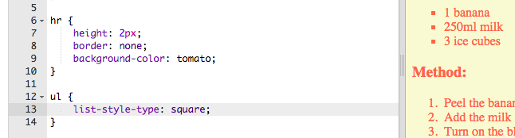

## शेवटचा हात

चला तर मग आपले वेबपृष्ठ सुधारित करण्यासाठी थोडे अधिक HTML आणि CSS जोडूया.

+ आपण आपल्या रेसिपीच्या शेवटी `
` टॅग वापरुन आडवी रेषा जोडू शकता.

लक्षात घ्या की `` टॅग प्रमाणेच या टॅगला शेवटचा टॅग नाही.

+ आपण आत्ताच जोडलेली रेषा आपल्या उर्वरित वेबपृष्ठाच्या शैलीशी जुळत नाही. चला काही css कोड जोडून ते नीट करूया:

    hr {
        height: 2px;
        border: none;
        background-color: tomato;
    }
    

+ या css कोडसह आपले बुलेट पॉइंट कसे दिसतात हे आपण बदलून पाहू शकता:

    ul {
        list-style-type: square;
    }
    

