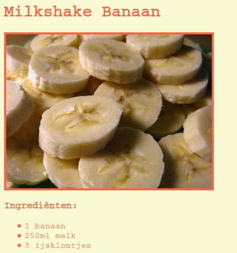

--- challenge ---

## Uitdaging: meer stijl

Kun je een afbeelding toevoegen aan je webpagina? Of het lettertype veranderen? Zo zou de webpagina eruit zou kunnen zien:

Hier is wat code die je kan helpen:

    font-family: Arial / Comic Sans MS / Courier / Impact / Tahoma;
    font-size: 12pt;
    font-weight: bold;
    
    
    

--- /challenge ---

***

### Door de community geleverde vertaling

Dit project werd vertaald door **Henny van Ham** en gecontroleerd door **Cor Groot**.

Onze geweldige vertalers helpen ons om kinderen over de hele wereld de kans te geven te leren coderen. Jij kunt ons helpen nog meer kinderen te bereiken door onze projecten te vertalen - lees meer op [rpf.io/translators](https://rpf.io/translators).