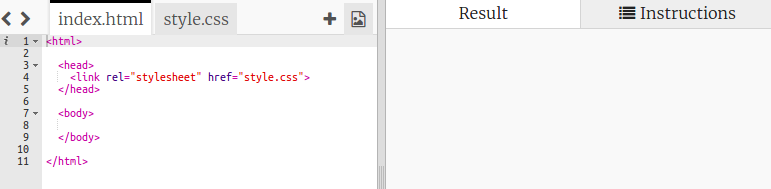
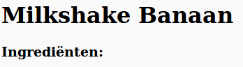
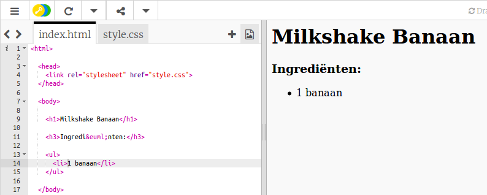

## Ingrediënten

We gaan een lijst maken van de ingrediënten die voor het recept nodig zijn.

+ Open deze sjabloon trinket: [jumpto.cc/html-template](http://jumpto.cc/html-template){: target = "_ blank"}.
    
    Het project zou er als volgt uit moeten zien:
    
    

+ Voor de lijst met ingrediënten ga je een **ongeordende lijst** gebruiken, met behulp van de `<ul>` tag. Ga naar regel 8 van het sjabloon en voeg deze HTML toe, die de tekst vervangt in de `<h1>` kop met de naam van je eigen recept:

    <h1>Milkshake Banaan</h1>
    
    <h3>Ingrediënten:</h3>
    
    <ul>
    
    </ul>
    

+ Bekijk je webpagina, je zou nu twee koppen moeten zien.

Je ziet geen lijst omdat je er nog geen items aan hebt toegevoegd!

+ De volgende stap is om items toe te voegen aan je lijst met behulp van de `<li>` tag. Voeg de volgende code toe aan de `<ul>` tag:

    <li>1 banaan</li>
    

Omdat de lijst niet is geordend, zijn er geen nummers naast de lijstitems, alleen opsommingstekens.