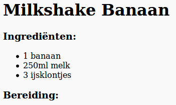
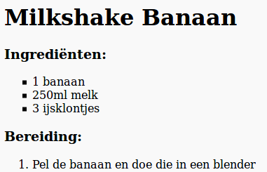

## Bereiding

We gaan nu uitleggen hoe je het recept maakt.

+ Je gaat een andere lijst gebruiken om de bereiding te schrijven, maar deze keer gebruik je een **geordende lijst**door de `<ol>` tag te gebruiken.

Een geordende lijst is een genummerde lijst die je gebruikt als de volgorde van de stappen belangrijk is.

Voeg deze code toe onder je ingrediëntenlijst en zorg ervoor dat deze nog steeds in de `<body>` tag zit:

    <h3>Bereiding:</h3>
    
    <ol>
    
    </ol>
    

+ Je hoeft nu alleen nog maar items toe te voegen aan de nieuwe geordende lijst:

    <li>Pel de banaan en doe die in een blender</li>
    

Merk op dat de lijstitems automatisch genummerd zijn!