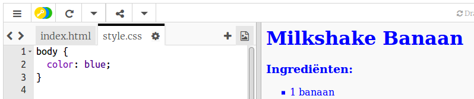
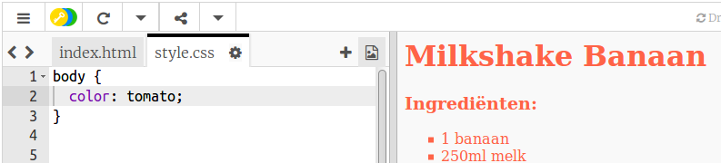
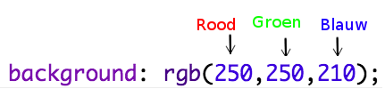
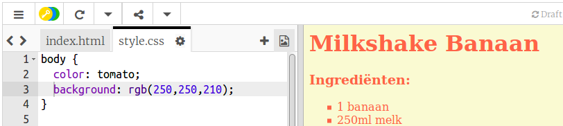
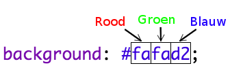
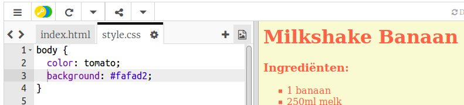

## Kleuren!

We gaan wat kleur toevoegen aan je recepten webpagina.

+ Je hebt al geleerd hoe je gekleurde tekst aan een webpagina kunt toevoegen. Voeg deze code toe aan het `style.css` bestand om alle tekst in de body van de website blauw te maken:

    body {
        color: blue;
    }
    

+ De browser kent kleuren als `blue`, `yellow` en zelfs `lightgreen`, maar wist je dat de browser de **namen** van meer dan 140 verschillende kleuren kent?

Er is een lijst met alle kleurnamen die je kunt gebruiken: [jumpto.cc/colours](http://jumpto.cc/colours), met kleurnamen zoals `tomato`, `firebrick` en `peachpuff`.

Verander de tekstkleur van `blue` naar `tomato`.

+ De browser kent de namen van 140 kleuren, maar kent eigenlijk de **kleurwaarden** van meer dan 16 miljoen kleuren!

Om de browser te laten weten welke kleur moet worden weergegeven, hoef je alleen maar te laten weten hoeveel rood, groen en blauw er nodig is.

De hoeveelheden rood, groen en blauw worden geschreven als een getal tussen `0` en `255`.

Voeg deze code toe aan de CSS om voor de hoofdtekst van de webpagina een ​​lichtgele achtergrond te krijgen:

    background: rgb(250,250,210);
    

+ Als je wilt kunt je de browser vertellen welke kleur moet worden weergegeven met een hexadecimale code (of **hex-code**). Dit werkt op dezelfde manier als de `rgb()` code hierboven, behalve dat hex-codes altijd beginnen met een `#` en hexadecimale 'getallen' gebruiken tussen `00` en `ff` voor de hoeveelheid rood, groen en blauw.

Vervang de `rgb()` code in je CSS met deze hex-code:

    background: #fafad2;
    

Je zou hetzelfde lichtgeel moeten zien als eerder!