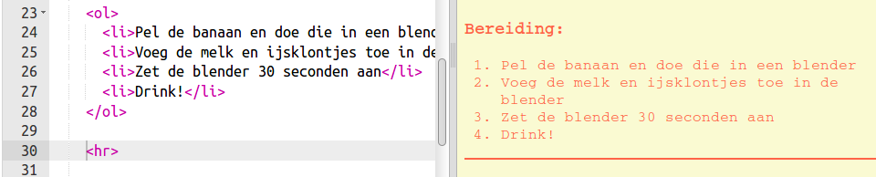
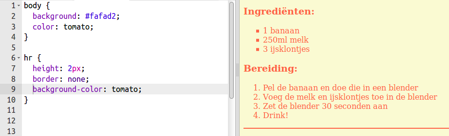
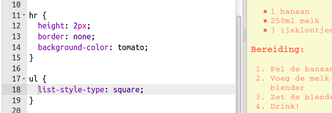

## Afwerking

We gaan een beetje meer HTML en CSS toevoegen om de webpagina te verbeteren.

+ Je kunt aan het einde van je recept een horizontale lijn toevoegen met behulp van de `
` tag.

Let op: deze tag heeft geen eindtag, net als de tag ``.

+ De regel die je zojuist hebt toegevoegd komt niet overeen met de stijl van de rest van de webpagina. Laten we dit oplossen door CSS-code toe te voegen:

    hr {
        height: 2px;
        border: none;
        background-color: tomato;
    }
    

+ Je kunt zelfs het uiterlijk van de opsommingstekens veranderen met deze CSS-code:

    ul {
        list-style-type: square;
    }
    

