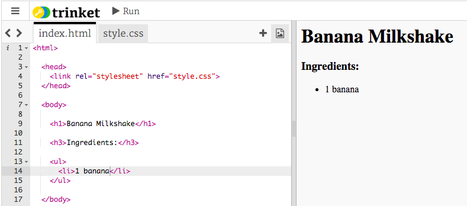

## ingredienser

La oss liste ingrediensene som trengs for oppskriften din.

+ Åpne denne malbehandlingen: [jumpto.cc/html-template](http://jumpto.cc/html-template){: target = "_ blank"}.
    
    Prosjektet skal se slik ut:
    
    

+ For listen over ingredienser, skal du bruke en **uordnet liste**, ved hjelp av `<ul>` taggen. Gå til linje 8 i malen og legg til denne HTML-teksten, erstatt teksten i `<h1>` tittelen med navnet på din egen oppskrift:

    <h1>Banan Milkshake</h1>
    
    <h3>Ingredienser:</h3>
    
    <ul>
    
    </ul>
    

+ Se din nettside, og du bør se de to overskriftene dine.

Du vil ikke se listen din ennå, fordi du ikke har lagt til noen listeposter til den!

+ Det neste trinnet er å legge til listeposter i listen din, ved å bruke `<li>` taggen. Legg til følgende kode inne i din `<ul>` tag:

    <li>1 banan</li>
    

Siden listen er uordnet, er det ingen tall ved siden av listepostene, bare punktposter.