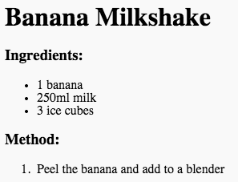

## Metode

Neste, la oss forklare hvordan du lager oppskriften din.

+ Du skal bruke en annen liste for å skrive metoden din, men denne gangen bruker du en **bestilt liste**ved å bruke `<ol>` taggen.

En bestilt liste er en nummerert liste, som du bør bruke når rekkefølgen av trinnene er viktig.

Legg til denne koden under ingredienslisten din, og sørg for at den fortsatt er inne i din `<body>` tag:

    <h3>Metode:</h3>
    
    <ol>
    
    </ol>
    

+ Nå trenger du bare å legge til listeposter i den nye, bestilte listen:

    <li>Skal bananen og legg til en blender</li>
    

Legg merke til at listepostene automatisk nummereres!