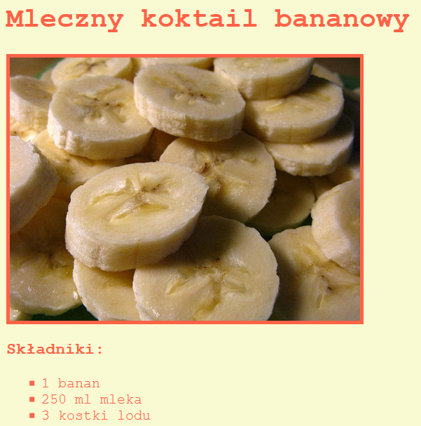

## Wprowadzenie

W tym projekcie nauczysz się, jak stworzyć stronę internetową dla Twojego ulubionego przepisu.

### Dodatkowe informacje dla prowadzących klub

Jeśli chcesz wydrukować ten projekt, użyj [wersji do druku](https://projects.raspberrypi.org/en/projects/recipe/print).

## \--- collapse \---

## title: Notatki dla liderów klubów

## Wprowadzenie:

W tym projekcie dzieci dowiedzą się o listach w HTML i kolorach w CSS. Stworzą własny przepis, dodając listy składników i poleceń.

## Zasoby Online

Do pisania kodu HTML i CSS online rekomendujemy użytkowanie edytora [trinket](https://trinket.io/).

Dzieci mogą też używać pustego edytora [(jumpto.cc/html-blank)](http://jumpto.cc/html-blank) do pisania swojego kodu HTML i CSS lub skorzystać z tego szablonu [(jumpto.cc/html-template)](http://jumpto.cc/html-template).

Dostępny jest także projekt zawierający przykładowe rozwiązania wyzwań:

+ [Ukończony projekt "Przepis" -- trinket.io/html/c0fd9b40cd](https://trinket.io/html/c0fd9b40cd)

## Zasoby Offline

Ten projekt można także [wykonać offline](https://www.codeclubprojects.org/en-GB/resources/webdev-working-offline/). Materiały potrzebne do wykonania projektu dostępne są po kliknięciu linku "Materiały do projektu". Można znaleźć tam sekcję "Zasoby", która zawiera zasoby potrzebne dzieciom do wykonania projektu w trybie offline. Upewnij się, że każde dziecko ma dostęp do tych zasobów. Ta sekcja zawiera następujące pliki:

+ template/index.html
+ template/style.css

Ukończoną wersję zadań z tego projektu można również znaleźć w sekcji "Zasoby dla wolontariuszy", która zawiera:

+ recipe-finished/index.html
+ recipe-finished/style.css
+ recipe-finished/banana.jpg

(Wszystkie powyższe zasoby można również pobrać jako pliki `.zip`.)

## Cele dydaktyczne

+ Tworzenie kodu HTML:
    
    + Znaczniki list `<ul>`, `<ol>` i `<li>`;
    + Znacznik `
`;
    + Utrwalenie zastosowania zagnieżdżonych znaczników.

+ Tworzenie kodu CSS:
    
    + Kolory(nazwy i kody szesnastkowe).

Projekt ten obejmuje elementy z następujących wątków [Cyfrowego programu nauczania Raspberry Pi](http://rpf.io/curriculum):

+ [ Projektuj podstawowe zasoby 2D i 3D](https://www.raspberrypi.org/curriculum/design/creator).

## Zadania

"More ingredients" - adding more items to an unordered list; "More steps" - adding more items to an ordered list; "More colours" - adding colour names, rgb values and hex codes; "Reviews" - adding another unordered list; "More styling" - adding images and fonts.

## Wykonanie projektu offline

If children are completing this project offline, they’ll need to save images they intend to use in the same folder as their Template.html file.

They can then just add the name of the file in their `` tags:

    
    

\--- /collapse \---

## \--- collapse \---

## title: Materiały do projektu

## Zasoby

+ [Plik .zip zawierający wszystkie zasoby potrzebne do wykonania projektu](resources/recipe-project-resources.zip)
+ [Pusty szablon Trinket](http://jumpto.cc/trinket-template)
+ [Pusty Trinket](http://jumpto.cc/trinket-blank)
+ [template/index.html](resources/template-index.html)
+ [template/style.css](resources/template-style.css)

## Zasoby dla lidera klubu

+ [Plik .zip zawierający zasoby z ukończonym projektem](resources/recipe-volunteer-resources.zip)
+ [Ukończony projekt "Kolorowe Kreacje"](https://trinket.io/html/c0fd9b40cd)
+ [recipe-finished/index.html](resources/recipe-finished-index.html)
+ [recipe-finished/style.css](resources/recipe-finished-style.css)
+ [recipe-finished/banana.png](resources/recipe-finished-banana.png)

\--- /collapse \---