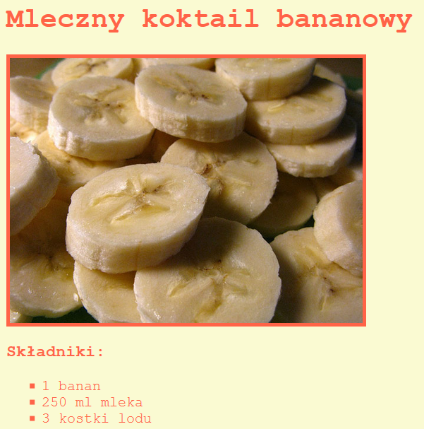

\--- challenge \---

## Wyzwanie: Więcej dekoracji

Czy możesz dodać obraz do twojej strony internetowej? Albo zmienić czcionkę? Oto jak może wyglądać twoja strona internetowa:

Oto kod, który tobie pomoże:

    font-family: Arial / Comic Sans MS / Courier / Impact / Tahoma;
    font-size: 12pt;
    font-weight: bold;
    
    
    

\--- /challenge \---