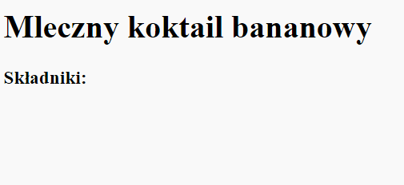
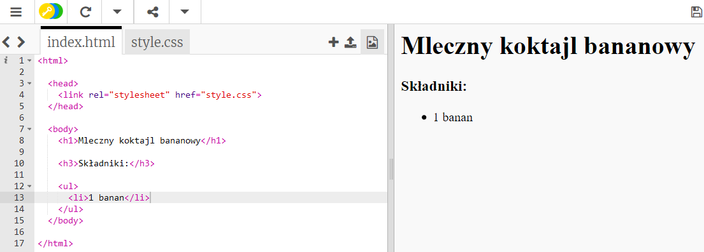

## Składniki

Wypiszmy składniki potrzebne do twojego przepisu.

+ Otwórz ten szablon trinket: [jumpto.cc/html-template](http://jumpto.cc/html-template){:target="_blank"}.
    
    Projekt powinien wyglądać następująco:
    
    

+ Do twojej listy składników użyjesz **nienumerowanej listy**, wykorzystując znacznik `<ul>`. Przejdź do linii nr 8 w szablonie i dodaj ten HTML, zamieniając tekst w tytule `<h1>` na nazwę twojego przepisu:

    <h1>Milkshake Bananowy</h1>
    
    <h3>Składniki:</h3>
    
    <ul>
    
    </ul>
    

+ View your webpage, and you should see your two headings.

You won’t see your list yet though, because you haven’t added any list items to it!

+ The next step is to add list items into your list, by using the `<li>` tag. Add the following code inside your `<ul>` tag:

    <li>1 banana</li>
    

As your list is unordered, there are no numbers next to the list items, just bullet points.